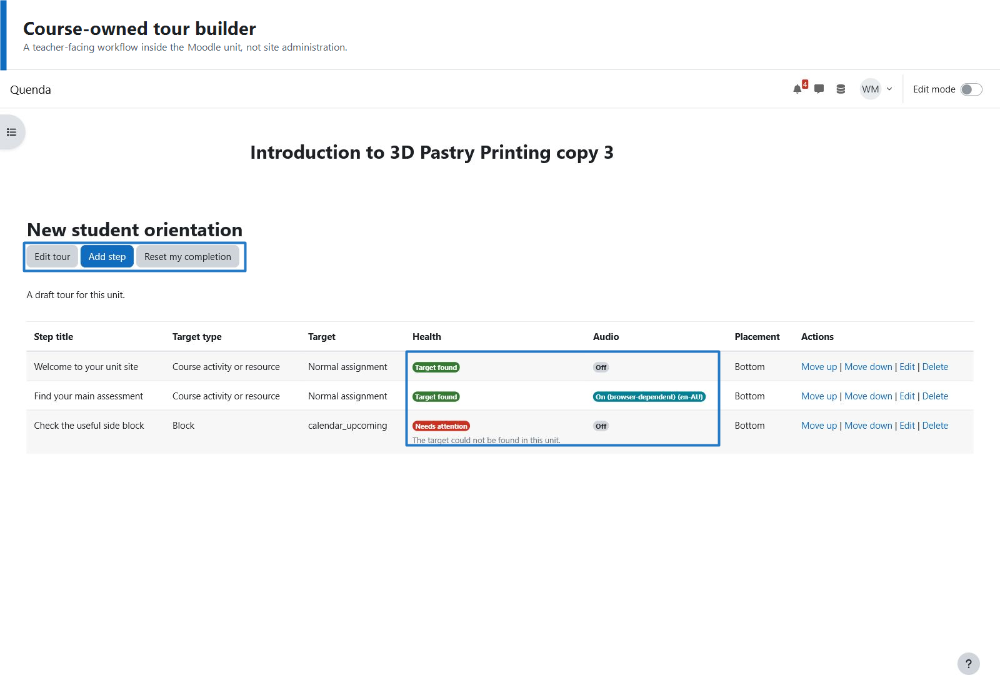
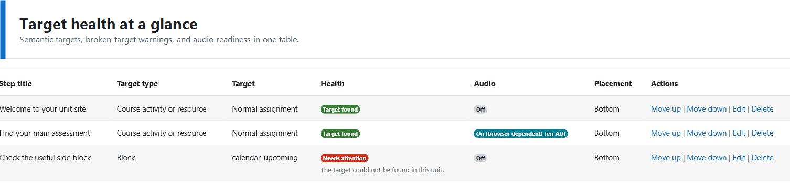
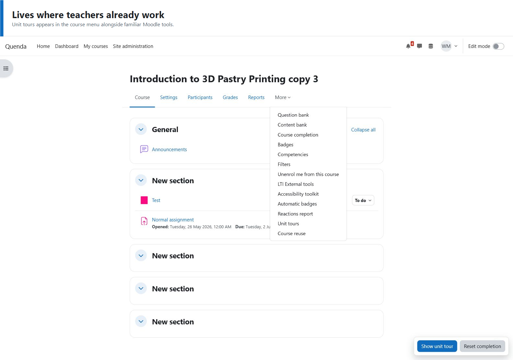
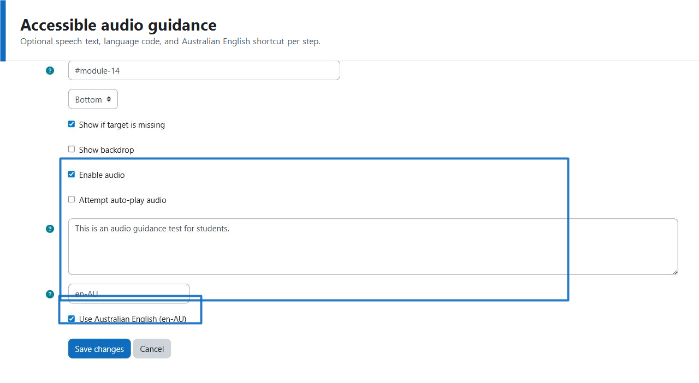
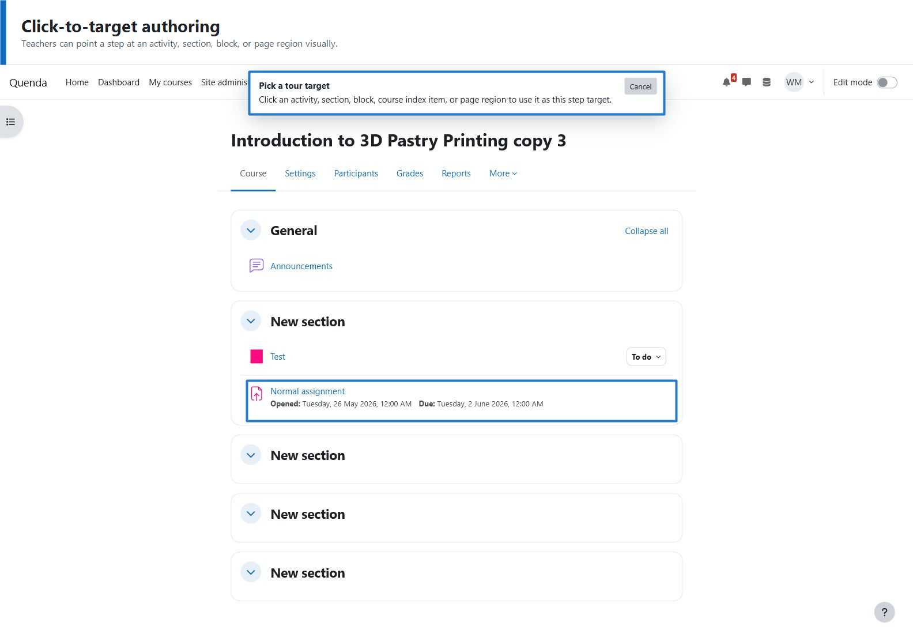
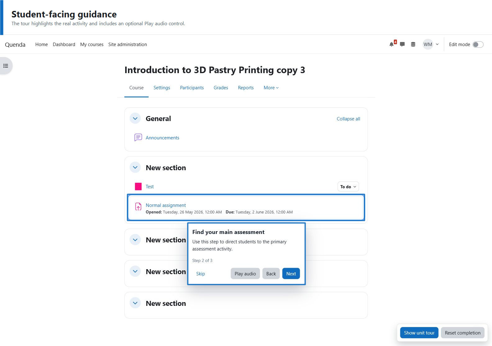
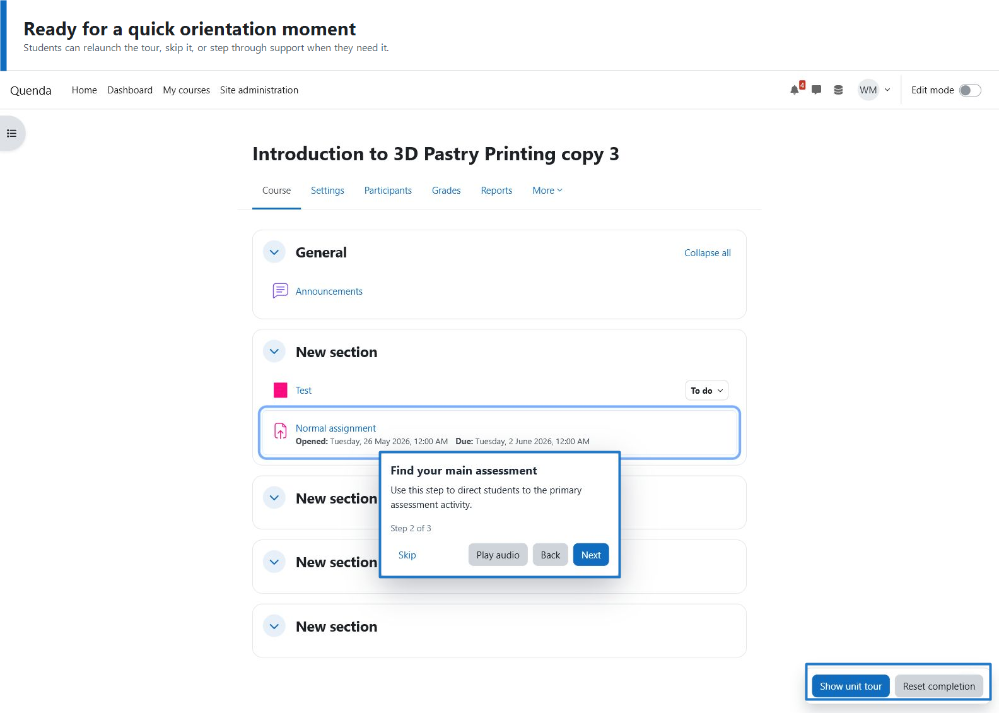

# Unit tours

`local_unittours` is an early Moodle plugin prototype for course-owned student tours.

Minimum Moodle version: 4.5 (`$plugin->requires = 2024100700`). The current development and compatibility review environment is Moodle 5.1.4+.

The plugin is intended to solve the limitations of native Moodle User tours for unit-specific guidance:

- tours should belong to a course, not only the site administration area;
- editing teachers should be able to author tours without CSS selector knowledge;
- tours should survive course copy and semester rollover by targeting Moodle objects where possible;
- broken targets should be detectable and repairable after a unit is cloned.

## Current prototype slice

- Adds course-level capabilities for managing and viewing unit tours.
- Adds a course navigation link for editing teachers.
- Creates database tables for tours, steps, and per-user completion state.
- Provides a simple in-course management page.
- Can create an initial disabled draft tour with one unattached welcome step.
- Provides basic edit pages for tours and steps.
- Provides delete actions for tours and steps.
- Plays enabled tours on course pages with a lightweight AMD runner.
- Records completed or skipped tours in Moodle.
- Provides an early click-to-target picker from the step edit form.
- Shows target labels and target health on the tour detail page.
- Includes tours and steps in course backup/restore.
- Remaps course-module and section targets when Moodle restore mappings are available.
- Adds step ordering controls (move up/down).
- Adds relaunch and reset-completion controls for testing.
- Adds optional per-step audio text with browser speech playback.
- Supports selected Moodle groups as a tour audience.
- Cleans up tour data when a Moodle course is deleted.
- Supports semantic course navigation targets such as Grades and Participants.
- Includes basic keyboard/focus handling for the student-facing tour dialog.
- Logs tour started, completed, and skipped events to Moodle's standard event log.

## Screenshots















## Target model

Steps should prefer semantic Moodle targets before falling back to CSS selectors:

- course modules;
- course sections;
- blocks;
- course index entries;
- course navigation items;
- page regions;
- raw selectors as an escape hatch.

## Not implemented yet

- Rich visual authoring with target labels, previews, and validation.
- Full target health checks after course copy, including browser-side selector validation.
- Automated browser or Behat smoke coverage for activity, section, block, navigation, and missing-target playback.

## Backup/Restore Smoke Test

Run this command from the project workspace:

```powershell
powershell -ExecutionPolicy Bypass -File .\local_unittours\scripts\backup_restore_smoke.ps1
```

Optional parameters:

```powershell
powershell -ExecutionPolicy Bypass -File .\local_unittours\scripts\backup_restore_smoke.ps1 -SourceCourseId 2 -TargetCategoryId 1
```

## Known Limits

- `selector` targets are marked `Unchecked` server-side because CSS selector validity is currently verified during browser playback, not in PHP.
- If a theme changes core markup significantly, fallback selectors may require manual refresh with the target picker.
- The relaunch button starts the first enabled tour in this prototype slice; multi-tour chooser UI is not implemented yet.
- Audio playback relies on browser speech APIs and may behave differently across browsers/devices.
- Audio auto-play may be blocked by browser policy; users can still press `Play audio` manually.

## Mobile App Compatibility (Important)

- Moodle app behavior for custom local-plugin JS must be validated separately.
- Test checklist for app QA:
  - launcher visibility on course pages
  - popover/modal layout and keyboard behavior
  - target resolution for navigation/activity/block steps
  - audio playback behavior and mute/focus handling
- If app webview support is limited, define fallback behavior (core text content without advanced popover interactions).

## Compatibility Notes

- [Moodle 5.1 compatibility review](docs/moodle-5.1-compatibility-review.md)
